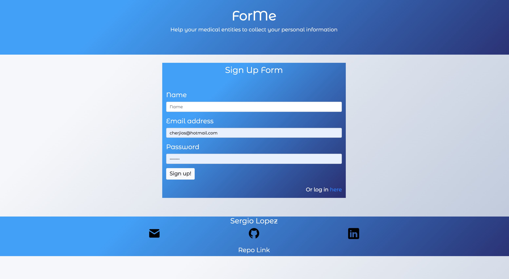
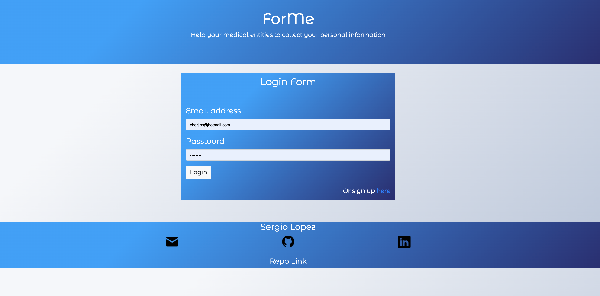
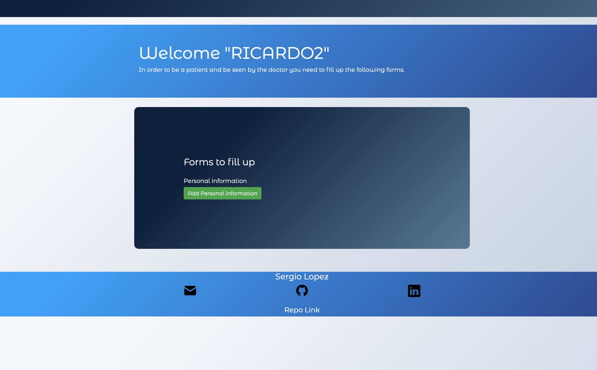
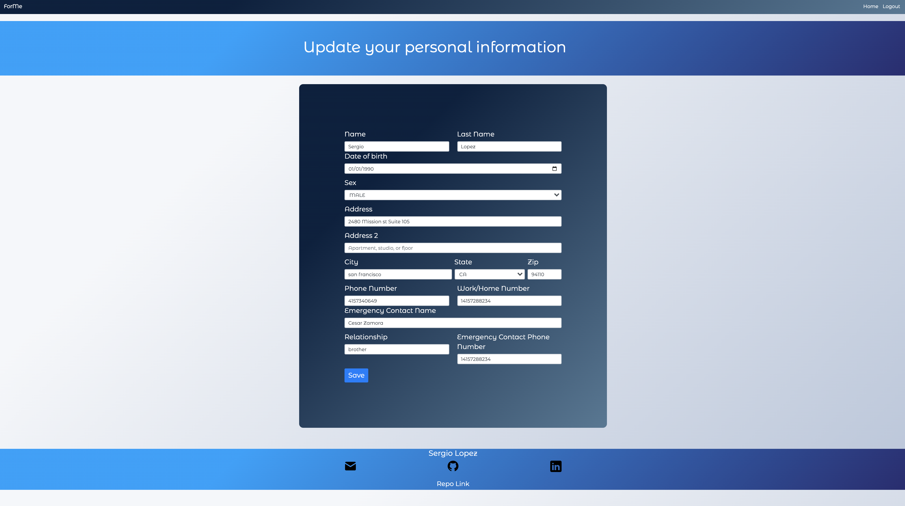
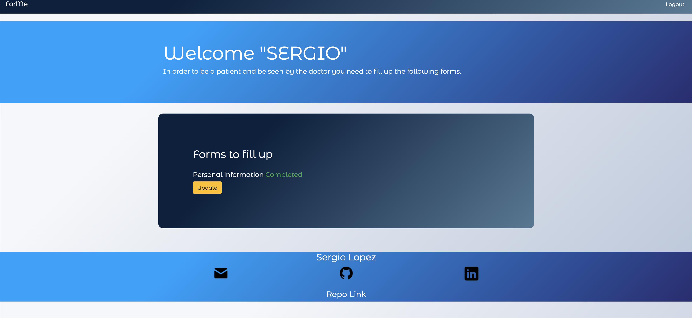
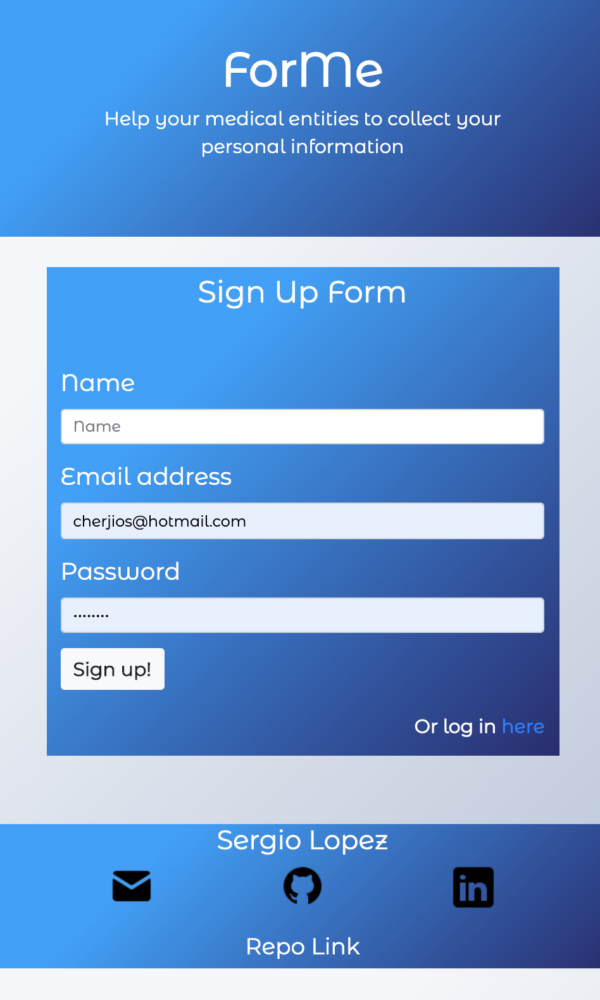
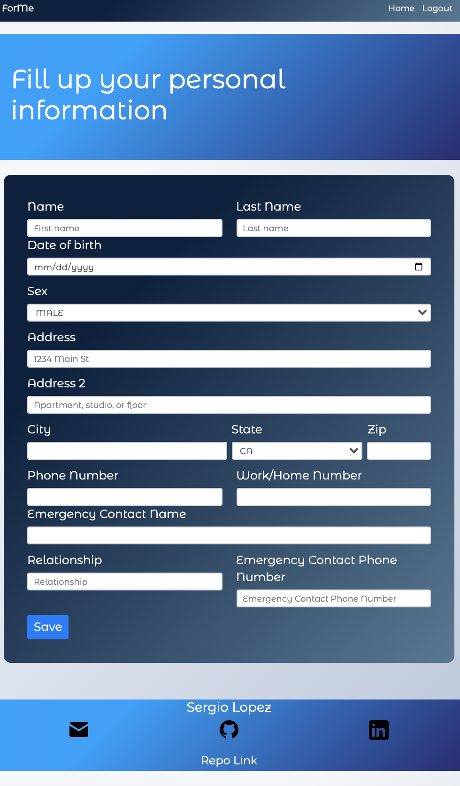
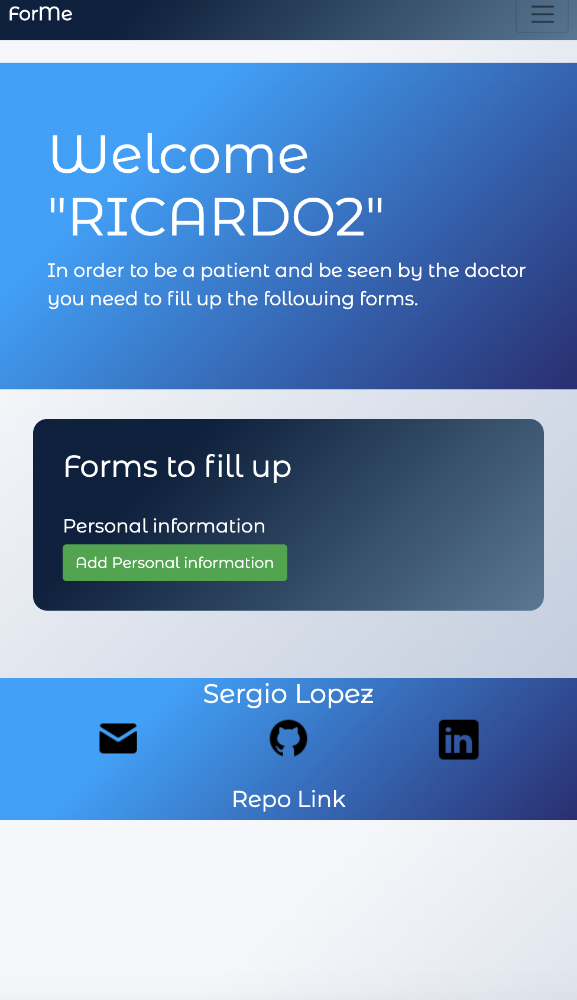

# ForMe
This is a mobile responsive web application that helps to collect data from the user and notify by email with an attachment with the information collected to the party interested. Notifying every time that the user has upload information or update information.

This application contains only a personal information form for testing propose that could be filled by the user. The user has to register with name, email, and password to get access to the home page, then user is able to fill up personal information.  

This application could be customized depending on the information we want to collect from the user. For example, this application could be used by a Dental office to collect personal information, medical history, and dental history from the user. We could add as many forms as we need.

## Deployed link
[https://formesergio.herokuapp.com/](https://formesergio.herokuapp.com/)

## View

### Full Screen







### Responsive view




## Table of Contents
- [Installation](#Installation)
- [Technology](#Technology)
- [Tools](#Tools)
- [Contributing](#Contributing)
- [Questions](#Questions)

## Installation
```
git clone git@github.com:Cherjios/Portfolio-page-2.git
cd Portfolio-page-2.git
```
### Instaling npm packages 
```
npm install express
```

## Technology
* [Javascript](https://developer.mozilla.org/en-US/docs/Web/)
* [HTML](https://developer.mozilla.org/en-US/docs/Web/HTML)
* [CSS](https://developer.mozilla.org/en-US/docs/Web/CSS)

## Tools
* [Node.js](https://nodejs.org/en/)
* [npm](https://www.npmjs.com/)

## Contributing
* **SERGIO LOPEZ** 

- [Link to Portfolio Site](https://cherjios.github.io/Responsive-Portfolio/)
- [Link to Github](https://github.com/cherjios)
- [Link to LinkedIn](https://www.linkedin.com/in/sergio-lopez-81790579)

## Questions
 sc.lopezm@gmail.com

